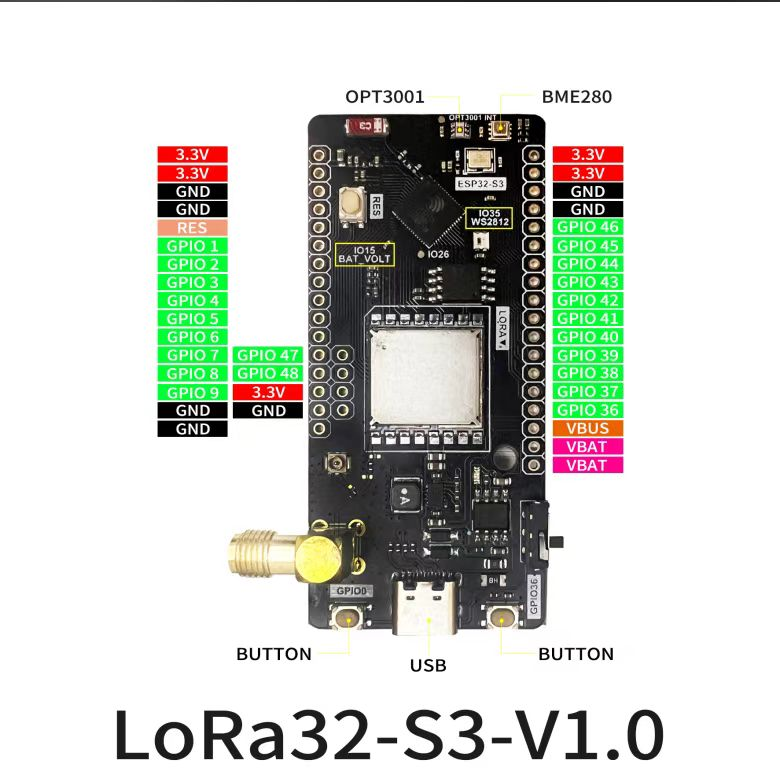

# <center>LoRa32-S3</center>

## Describe
The LoRa32-S3 development board is a development board built by the Link32 team based on the ESP32-S3 microcontroller as the main control. The board is equipped with light intensity and temperature and humidity sensing capabilities. It also has long-distance LoRa transmission capabilities. It has a rich set of customizable IO ports and can work independently using a lithium battery.



## Basic Information

|  Param   | LoRa32-S3  |
|  ----  | ----  |
| MCU  | ESP32-S3 |
| Flash Size  | 16MB(128Mb) |
| Download  | USB/JTAG |
| Light sensor  | OPT3001 |
| Humidity Sensor  | BME280 |
| LoRa Module  | SX1262 |
| LED  | WS2812 |
| Power Management  | MP28164GD-Z |
| Battery Management | TP4065 |

## Pinout

## How to use
### Arduino

1. Install the ESP32-S3 board support package
   - Open the Arduino IDE, click `File` -> `Preferences`, and enter the following URL in the `Additional Board Manager URLs` field:
     ```
     https://espressif.github.io/arduino-esp32/package_esp32_index.json
     ```
   - Click `Tools` -> `Board` -> `Boards Manager`, search for `ESP32-S3` and install it.
2. Install the LoRa library
    - Click `Sketch` -> `Include Library` -> `Manage Libraries`, search for `LoRa` and install it.
3. Select the board
    - Click `Tools` -> `Board` -> `ESP32-S3 Dev Module`
4. Select the port  
    - Click `Tools` -> `Port` -> select the corresponding port
5. Compile and upload the code
    - Click the `Upload` button to compile and upload the code to the development board.

### Platform IO

1. Install the ESP32-S3 board support package
   - Open the Platform IO, click `PlatformIO Home` -> `Platforms` -> `Espressif 32`, click `Install` on the `ESP32-S3` line.
2. Install the LoRa library
    - Click `PlatformIO Home` -> `Libraries`, search for `LoRa` and install it.
3. Select the board
    - Open the `platformio.ini` file and modify the `board` parameter to `esp32s3devmodule`.
4. Select the port
    - Click `PlatformIO Home` -> `Devices`, select the corresponding port.
5. Compile and upload the code
    - Click the `Upload` button to compile and upload the code to the development board.


